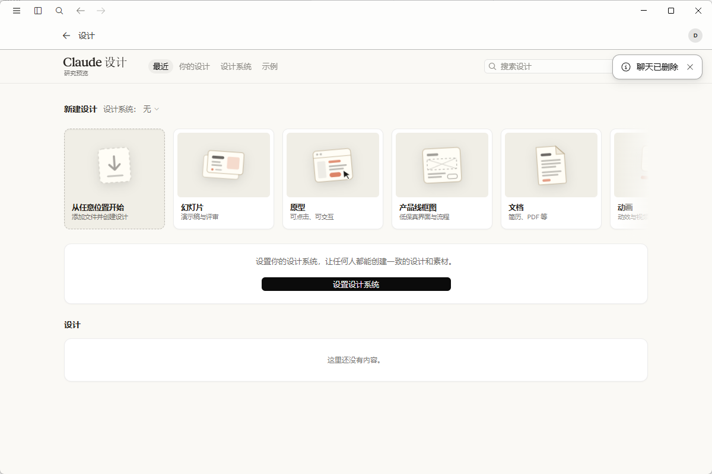
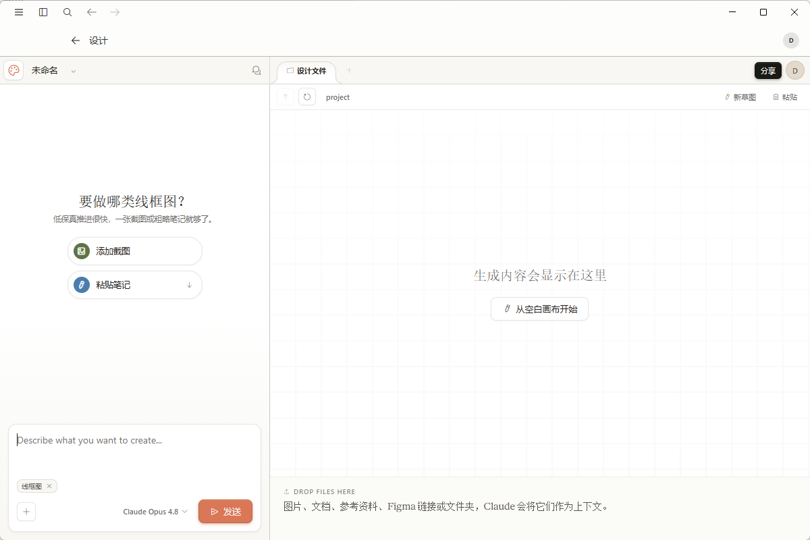
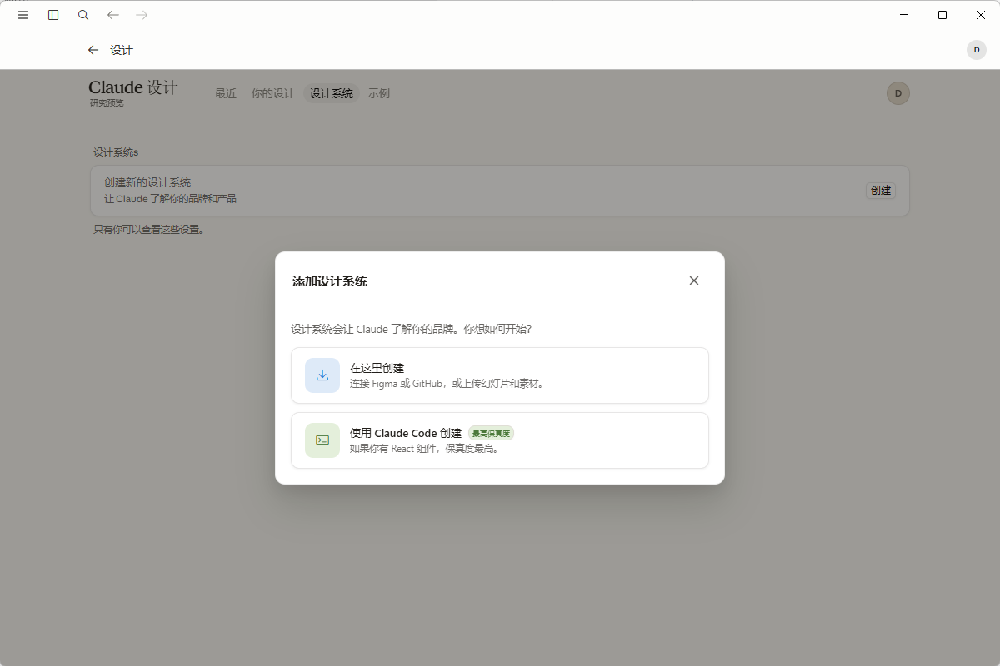

# Claude Desktop 中文补丁

Windows 版 Claude Desktop 的本地中文界面补丁。项目通过本机 HTTPS 代理注入运行时汉化脚本，尽量不改动 Claude 主程序文件。

> 当前主要覆盖 Claude Desktop、Cowork、Claude Design、Artifact/作品区常见界面。图片、视频、Canvas 预览内容里的英文不属于 DOM 文本，暂时不会被脚本翻译。

## 为什么做这个

很多 Claude Desktop 汉化方案主要覆盖聊天页、菜单和设置页，Claude Design、空白画布、设计系统、作品/Artifact 等新功能页面容易漏翻。本项目的重点就是把这些高频但难覆盖的界面也补齐，让中文用户可以直接看懂 Design 工作流。

目前已重点适配：

- Claude Design 首页、最近设计、示例、设计系统。
- 幻灯片、原型、产品线框图、文档、动画等 Design 创建入口。
- 空白画布编辑器、拖放区、画布工具栏和生成输入框。
- 设计系统创建、Claude Code 上传组件、Figma/代码/素材导入流程。
- Cowork、Artifact/作品、连接器、设置、菜单等常用界面。

## 和常见汉化方案的区别

这个项目不是简单替换几个本地语言文件，而是围绕 Claude Desktop 新版本的实际问题做了一套更稳的运行时补丁：

- **重点覆盖 Claude Design**：目前很多汉化项目还停留在聊天页和菜单层面，Design 首页、空白画布、设计系统、示例页、作品/Artifact 细节容易漏。本项目把这些新界面作为重点维护。
- **避开 Workspace VM / Cowork 故障**：只代理静态资源域名，不代理 `a.claude.ai`，避免因为拦截主 API 域名导致登录回退、Workspace VM 连接超时、Cowork VM service not running 等问题。
- **不强行使用不被官方接受的 locale**：Claude 后端当前只接受固定 locale 列表。脚本会在前端显示中文，同时把请求里的 `zh-CN` 回写成官方可接受的 `en-US`，避免出现 `locale: Input should be ...` 的报错。
- **运行时 DOM 补丁更细**：除了普通文本，也处理 `placeholder`、`aria-label`、tooltip、按钮属性、部分输入框固定 UI 值等，因此能覆盖更多弹窗、菜单和动态界面。
- **可安装、可卸载、可恢复**：提供 `install.ps1` / `uninstall.ps1`，自动创建桌面快捷方式，并尽量把 hosts、代理例外、缓存清理这些步骤做成一键流程。
- **保留 Claude 原有能力**：不改动账号登录链路，不拦截会话通信域名，目标是汉化界面而不是破坏 Claude Desktop 的工作区、连接器和远程能力。

## 截图预览

### Claude Design 首页



### 空白画布 / 线框图流程



### 设计系统弹窗



## 特性

- 内置常用中文词库，包含登录、聊天、协作、Claude Design、作品、设置、菜单等界面。
- 针对 Claude Design 做了额外补丁，覆盖空白画布、设计系统、示例页、创建流程等细节。
- 只拦截静态资源域名：`assets-proxy.anthropic.com`、`a-cdn.claude.ai`。
- 不拦截 `a.claude.ai`，避免影响登录、Workspace VM、会话通信。
- 自动创建桌面快捷方式：`Claude 中文版`。
- 支持卸载 hosts 和系统代理例外配置。

## 环境要求

- Windows 10/11
- 已安装 Claude Desktop
- Python 3.10+
- PowerShell 以管理员身份运行

## 安装

在项目目录运行：

```powershell
powershell -ExecutionPolicy Bypass -File .\install.ps1
```

安装脚本会执行：

- 安装 Python 依赖
- 生成本机证书并加入当前用户信任根
- 写入 hosts，把静态资源域名指向本机代理
- 更新当前用户系统代理例外
- 启动汉化代理
- 创建桌面快捷方式
- 清理 Claude 的前端缓存

也可以手动运行：

```powershell
python -m pip install -r requirements.txt
python .\scripts\setup_claude_zh_proxy.py --install --start --clear-cache
```

## 使用

安装后从桌面打开 `Claude 中文版`。

如果 Claude 更新后出现英文回退，重新运行：

```powershell
powershell -ExecutionPolicy Bypass -File .\install.ps1
```

## 卸载

```powershell
powershell -ExecutionPolicy Bypass -File .\uninstall.ps1
```

卸载会停止本机代理、移除 hosts 规则、移除系统代理例外中的汉化域名，并删除桌面快捷方式。

## 已知限制

- Claude 官方更新前端后，可能出现新的英文漏词，需要补充词库。
- 图片、视频、预览画面、远程 Canvas 内嵌内容里的英文无法用 DOM 脚本直接翻译。
- 首次安装需要管理员权限写入 hosts。
- 本项目不是 Anthropic 官方项目，也不隶属于 Anthropic。

## 安全说明

本项目只代理 Claude 静态资源域名，用于注入汉化脚本。为避免影响账号、登录和 Workspace VM，不代理 `a.claude.ai`。

脚本会在本机生成证书并安装到当前用户信任根。卸载脚本会移除代理配置和 hosts 规则，但不会自动删除证书；如需完全清理，可在 Windows 证书管理器中删除名为 `Codex Claude Zh Root CA` 的当前用户根证书。
